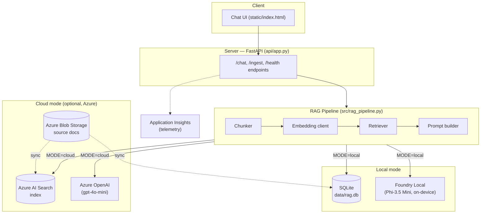

# Local RAG Assistant — Foundry Local + Azure Hybrid

An offline-first document Q&A assistant. It answers questions grounded in your
own documents using Retrieval-Augmented Generation (RAG), running entirely
on-device with [Microsoft Foundry Local](https://learn.microsoft.com/azure/ai-foundry/foundry-local/).

The same codebase can switch to a **cloud mode** — Azure AI Search for
retrieval and Azure OpenAI for generation — with a single config flag. This
demonstrates that Foundry Local's OpenAI-compatible API makes local-to-cloud
portability a non-issue, not a rewrite.

> Built as part of a Microsoft Summer Internship project, inspired by
> ["Building Your First Local RAG Application with Foundry Local"](https://techcommunity.microsoft.com/blog/azuredevcommunityblog/building-your-first-local-rag-application-with-foundry-local/4501968).

## Why this exists

Most AI assistants assume a stable connection to the cloud. This one doesn't.
It's designed for the scenario where a user has no internet access at all —
and it optionally upgrades to a cloud-backed, larger-scale setup when that
tradeoff makes sense (bigger document sets, no local hardware, shared team
access).

## Architecture



**Local mode**: everything runs on the machine. No network calls after the
one-time model download. Documents live as markdown files, chunked and
embedded with Foundry Local's embedding model, stored in SQLite.

**Cloud mode**: the same chunking/prompting logic, but retrieval goes through
Azure AI Search and generation through Azure OpenAI. Useful for larger
document sets, shared/team access, or when local hardware isn't available.

## Tech stack

| Layer | Local mode | Cloud mode |
|---|---|---|
| Server | FastAPI | FastAPI (same app) |
| Embeddings | Foundry Local (`qwen3-embedding-0.6b`) | Azure OpenAI embeddings (optional) or Azure AI Search vectorizer |
| Retrieval | Cosine similarity over SQLite-stored vectors | Azure AI Search |
| Generation | Foundry Local (`Phi-3.5-mini`) | Azure OpenAI (`gpt-4o-mini`) |
| Storage | SQLite (`data/rag.db`) | Azure Blob Storage + Azure AI Search index |
| Telemetry | Local logs | Application Insights |

## Project layout

```
├── api/app.py              FastAPI app: routes, serves the chat UI
├── src/
│   ├── config.py            Central config, reads .env, MODE switch
│   ├── db.py                SQLite schema + helpers
│   ├── chunking.py          Document chunking
│   ├── llm_client.py        Foundry Local + Azure OpenAI client wrappers
│   ├── retrieval.py         Local cosine-similarity retrieval
│   ├── rag_pipeline.py      Orchestrates retrieval + generation, mode switch
│   ├── azure_search.py      Azure AI Search index + query helpers
│   ├── azure_storage.py     Blob Storage document sync
│   └── telemetry.py         Application Insights logging
├── scripts/
│   ├── ingest.py            Chunk + embed + store documents (local mode)
│   └── sync_azure.py        Push docs to Blob Storage + Azure AI Search
├── static/index.html        Single-file chat UI
├── docs/sample_docs/        Example markdown knowledge base
├── tests/test_retrieval.py  Retrieval sanity tests
├── data/                    SQLite DB lives here (gitignored)
├── config.example.env       Template for environment variables
└── requirements.txt
```

## Setup — local mode (no Azure needed)

**1. Install Foundry Local**

```bash
# Windows
winget install Microsoft.FoundryLocal

# macOS
brew install microsoft/foundrylocal/foundrylocal
```

**2. Python environment**

```bash
python -m venv .venv
source .venv/bin/activate        # Windows: .venv\Scripts\activate
pip install -r requirements.txt
cp config.example.env .env
```

Leave `MODE=local` in `.env` — no Azure credentials required for this mode.

**3. Ingest the sample documents**

```bash
python scripts/ingest.py
```

This chunks the markdown files in `docs/sample_docs/`, generates embeddings
via Foundry Local, and stores them in `data/rag.db`.

**4. Run the app**

```bash
uvicorn api.app:app --reload
```

Open `http://127.0.0.1:8000`. Turn off Wi-Fi and it still works — that's the
whole point.

## Setup — cloud mode (optional, Azure)

Requires an Azure subscription (e.g. the Azure for Students $100 credit).

**1. Provision resources** (see `scripts/sync_azure.py` header comment for
the exact resources and free-tier SKUs used: Azure AI Search Free tier,
a Storage Account, an Azure OpenAI resource with a `gpt-4o-mini` deployment,
and Application Insights.)

**2. Fill in `.env`**

```
MODE=cloud
AZURE_SEARCH_ENDPOINT=...
AZURE_SEARCH_KEY=...
AZURE_SEARCH_INDEX=rag-index
AZURE_STORAGE_CONNECTION_STRING=...
AZURE_OPENAI_ENDPOINT=...
AZURE_OPENAI_KEY=...
AZURE_OPENAI_DEPLOYMENT=gpt-4o-mini
APPLICATIONINSIGHTS_CONNECTION_STRING=...
```

**3. Sync documents and switch mode**

```bash
python scripts/sync_azure.py
uvicorn api.app:app --reload
```

The chat UI and API surface are identical — only `MODE` changes.

## Cost & safety notes (cloud mode)

- Azure AI Search Free tier and Application Insights' free ingestion quota
  cover this project's needs at $0.
- Azure OpenAI is billed per token — set a **budget alert** in the Azure
  portal before testing.
- Never commit `.env`. `config.example.env` is the only file that should be
  tracked.
- If deploying a public demo, put a request-rate limit in front of the
  `/chat` endpoint (see `api/app.py`) so a public repo doesn't turn into an
  open tap on your credit.

## Testing

```bash
pytest tests/
```

## License

MIT — see `LICENSE`.