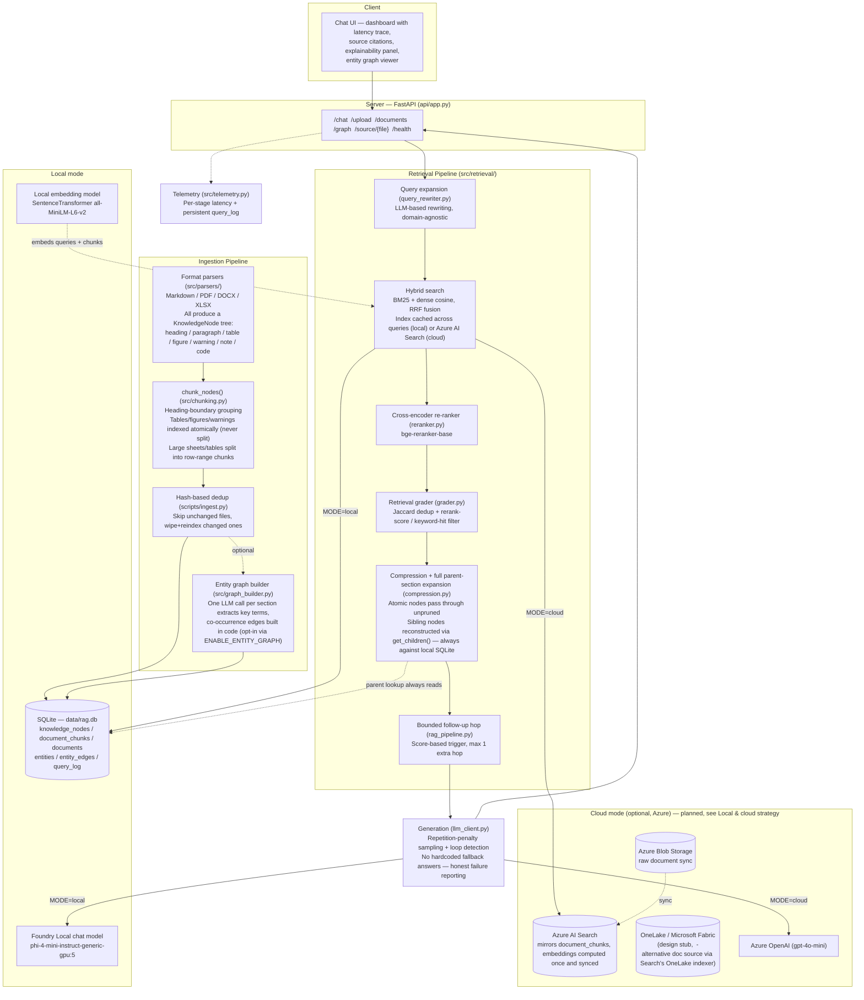

# Local RAG Assistant — Advanced Offline RAG with Foundry Local

An offline-first document Q&A assistant that answers questions grounded in
your own documents (Markdown, PDF, Word, Excel/CSV), running entirely
on-device with [Microsoft Foundry Local](https://learn.microsoft.com/azure/ai-foundry/foundry-local/).

This isn't a naive "embed and cosine-similarity" RAG demo. Documents are
parsed into a **hierarchical knowledge tree** (headings, tables, figures,
warnings — not flat text) with an **entity co-occurrence graph** layered on
top, retrieval combines **hybrid search (dense + BM25)**, **cross-encoder
re-ranking**, **retrieval grading**, **LLM-based query expansion**, and a
**bounded follow-up retrieval hop** for weak matches, and every stage
exposes its scores and latency so the mechanism is visible, not a black box.

The same codebase can also switch to a **cloud mode** (Azure AI Search +
Azure OpenAI) with a single config flag, since Foundry Local exposes an
OpenAI-compatible API. Local-to-cloud portability is a config change, not a
rewrite — see [Local & cloud strategy](#local--cloud-strategy) for exactly
what does and doesn't change.

> Full roadmap and design rationale for every architectural decision:
> [`docs/ROADMAP.md`](docs/ROADMAP.md)

## Measured system stats

Real numbers from the current database and git history, not estimates —
useful as a sense of scale rather than a claim of completeness.

| Metric | Value |
|---|---|
| Documents ingested | 7 |
| Knowledge tree nodes | 22,174 |
| Retrieval chunks indexed | 6,530 |
| Extracted entities | 20 |
| Entity co-occurrence edges | 58 |

The entity graph numbers are intentionally small right now: entity
extraction is opt-in (`ENABLE_ENTITY_GRAPH=true`, one LLM call per document
section) and the largest ingested document — a ~3,479-section technical
manual — has not yet been re-processed with the current extraction logic
(an earlier version of the prompt caused a repetition-loop failure on that
run; see [Engineering story](#engineering-story) below). This is a known,
tracked gap, not a hidden one.

## Why this exists

Most AI assistants assume a stable connection to the cloud. This one
doesn't. It's built for the scenario where a user has no internet access at
all — a field engineer, an air-gapped facility, a regulated environment —
and it optionally upgrades to a cloud-backed setup only when that tradeoff
is worth it (bigger document sets, shared team access, no local hardware).

## Engineering story

Feature lists explain *what* exists. This section explains *why* it exists
— the actual problem encountered, the reasoning behind the fix, and its
measured effect. Every row below is something that broke or fell short
during development of this project, not a hypothetical.

| Problem | Why it mattered | Solution | Benefit |
|---|---|---|---|
| Flat chunking loses document structure | A table row means nothing without its header; a paragraph means less without its section context | Hierarchical `KnowledgeNode` tree (heading/paragraph/table/figure/warning/note/code) built by every parser | Tables and figures are indexed atomically and never split mid-content |
| A matched excerpt is often incomplete on its own | "...apply after 600 hours" is meaningless without knowing *which* grease the preceding sentence named | Full parent-section reconstruction via `get_children()` in `compression.py` | The LLM receives the matched excerpt *and* its surrounding section, not just a heading label |
| Rebuilding BM25 + cosine similarity from scratch on every query doesn't scale | With more than a few hundred chunks, this alone can cost seconds per query | In-memory cached hybrid index in `hybrid.py`, invalidated only when the corpus size changes | Retrieval latency stays in the tens-of-milliseconds range regardless of query volume |
| Small local models degenerate on multi-chunk synthesis | The model fell into repeating "In the Nth document chunk, there is a mention of..." instead of answering | `_detect_repetition_loop()` guard + moving from `qwen3-0.6b` to `phi-4-mini` | Honest failure reporting instead of a wall of repeated, useless text reaching the user |
| Hardcoded synonym-based query expansion doesn't generalize | The original expander only recognized "grease/spindle/scara/maintenance" — every other topic got zero expansion | LLM-based `rewrite_query()`, domain-agnostic | Query expansion now works across any subject matter present in the ingested documents |
| One-shot retrieval fails genuinely multi-part questions | A single hybrid search pass can miss a question that needs two separate facts combined | A bounded follow-up hop in `rag_pipeline.py`: score-triggered, capped at exactly one extra retrieval round | Adaptive retrieval depth without an open-ended agentic loop or unpredictable latency |
| A local/cloud mode switch could silently break retrieval | Local embeddings (384-dim MiniLM) and Azure embeddings (1536-dim) are not interchangeable | `get_indexed_embedding_models()` + a consistency check at index-build time in `hybrid.py` | A clear, actionable error instead of a numpy shape-mismatch crash deep in a similarity computation |
| Short, structured LLM calls (query rewriting, entity extraction) used the full generation budget | Query expansion measured ~27s for what should be a 2-line output, with no quality benefit from the extra headroom | Per-call `max_tokens` override in `generate_chat_response()` | ~6.7x latency reduction on query expansion (27s → ~4s), no observed drop in output quality |
| Entity extraction produced zero entities across an entire 3,479-section document | The extraction prompt ended with a literal `"JSON array:"` label, which the model echoed back in a repetition loop instead of producing content | Rewrote the prompt to avoid the echo trigger; added a repetition-loop guard and regex-based JSON extraction tolerant of stray text | Entity extraction now reliably produces real terms (confirmed against a 119-section document; see Current limitations for the large-document re-run still pending) |

## Design philosophy

- **Node-tree, not chunk-first.** Every parser produces the same
  `KnowledgeNode` structure regardless of input format. Chunking is a
  *view* over that tree, not the primary representation — this is what
  makes parent-section reconstruction, atomic table/figure handling, and
  the entity graph possible without format-specific special-casing.
- **Bounded, not open-ended.** The follow-up retrieval hop is capped at
  exactly one extra round, triggered by a cheap score threshold, not an
  LLM "is this enough?" judgment. Agentic-sounding behavior without
  agentic-sized latency or unpredictability was a deliberate tradeoff,
  not a shortcut.
- **Fail honestly, never fabricate.** There are no hardcoded fallback
  answers anywhere in this pipeline. A wrong-but-confident canned response
  is worse than an explicit "insufficient context" or "generation failed"
  reply, because it fails silently on exactly the queries nobody thought to
  write a fallback for.
- **Measure before optimizing.** Every latency number in this README came
  from the telemetry panel on a real query, not a guess — including the
  query-expansion fix, which was only found because the `telemetry` dict
  made the 27-second stage visible in the first place.
- **Local-first, cloud-optional.** The retrieval/generation *logic*
  (rerank → grade → compress → parent-expansion → follow-up hop) is
  identical in both modes. Only the retrieval and generation *backends*
  swap out. See [Local & cloud strategy](#local--cloud-strategy).

## Lessons learned

- **A silently-passing filter is worse than no filter.** The retrieval
  grader's relevance threshold (`rerank_score > -3.0`) was effectively a
  no-op — `bge-reranker-base`'s logits rarely go that low — for an unknown
  period before it was caught and corrected to `> 0.0`. Only the Jaccard
  dedup was ever actually filtering anything.
- **Small models fail in specific, recognizable shapes, not randomly.**
  Both the generation repetition loop and the entity-extraction repetition
  loop were the *same failure pattern* (echoing a prompt fragment instead
  of producing content) in two different parts of the codebase. Once
  recognized once, it was straightforward to guard against elsewhere.
- **A working demo and a correct pipeline are not the same thing.**
  Several bugs (the grader threshold, an `insert_chunk()` field mapping
  that wrote `source_file` into the `doc_id` column, a missing
  `scripts/__init__.py`) produced no visible error and no obviously wrong
  output — they degraded quality or broke a later feature silently. Actual
  verification (checking DB contents, not just "the UI didn't crash") kept
  catching these.
- **Ingestion-time LLM calls scale with document structure, not document
  size.** A 3,479-section PDF took hours to entity-extract on local
  hardware, not because the file was large, but because the *section
  count* directly multiplies LLM call count. This is now opt-in
  (`ENABLE_ENTITY_GRAPH`) specifically because of this.

## Current limitations

Stated plainly rather than left implicit:

- **The entity graph is not yet consulted during retrieval.** It's
  currently a separate, explorable artifact (the graph viewer), not an
  additional retrieval signal. Graph-aware retrieval is future work.
- **The largest ingested document has not been re-processed with the
  current entity-extraction logic** (see Measured system stats above).
  The fix is verified on smaller documents; the large-document re-run is
  a pending, tracked task, not a hidden failure.
- **No automated evaluation yet.** There is no labeled eval set, no
  Precision@K/Recall@K/MRR measurement, and no faithfulness scoring. The
  "no naive-vs-advanced comparison" claim some RAG projects make is not
  one this README makes — that comparison doesn't exist yet. It's the
  next major piece of work (see Roadmap).
- **No automated test suite.** Correctness has been verified through
  manual testing and direct database inspection during development, not
  `pytest`. A test suite is planned, not implemented.
- **Cloud mode has not been run end-to-end yet.** `azure_search.py` and
  `azure_storage.py` exist as integration points in the architecture but
  have not yet been implemented and exercised against a live Azure
  subscription. See Local & cloud strategy for the intended design.
- **OneLake (Microsoft Fabric) was evaluated as an alternative document
  source** to Blob Storage sync, via Azure AI Search's OneLake indexer
  (indexing files directly from a Fabric Lakehouse). Not attempted: it
  requires a separately-provisioned Fabric capacity, and Azure AI Search
  itself could not be provisioned under the available subscription due
  to regional capacity limits (see above) - attempting a second,
  likely-more-restricted resource type wasn't a good use of time before
  the first was confirmed available. `src/azure_onelake.py` records the
  integration point as a stub for future work.

## What makes this different from a tutorial RAG project

| Naive RAG (typical tutorial) | This project |
|---|---|
| Single dense (embedding) retrieval | Hybrid retrieval: dense + BM25, fused with Reciprocal Rank Fusion, index built once and cached |
| Top-K by raw similarity score | Cross-encoder re-ranking on top-K candidates before generation |
| Always trusts retrieved chunks | Retrieval grader checks relevance before the LLM sees the context; falls back to an honest "insufficient context" reply instead of hallucinating or returning a canned answer |
| Flat text, fixed-size chunking | Documents parsed into a **hierarchical node tree**, chunked on heading boundaries with atomic tables/figures never split mid-content |
| Markdown only | Markdown, PDF, DOCX, XLSX/CSV via a pluggable parser interface, each producing the same node-tree structure |
| Matched chunk in isolation | Full parent-section reconstruction: a matched excerpt arrives with its surrounding section content, not just a heading label |
| One-shot retrieval, no adaptivity | Bounded follow-up hop: weak initial matches trigger one extra sub-query decomposition + retrieval round (capped, never an open-ended loop) |
| No cross-document/concept relationships | Entity co-occurrence graph extracted per section, explorable as an interactive visualization |
| No visibility into *why* an answer was produced | Explainability panel: per-chunk BM25/dense/rerank scores, section/heading provenance, click-through source citations, latency breakdown per pipeline stage |
| Re-embeds every file on every run | Hash-based incremental ingestion: unchanged files are skipped entirely, changed files are cleanly re-indexed |
| Silently degrades on small/local models | Repetition-loop detection (generation *and* entity extraction) catches degenerate output and reports failure honestly instead of returning garbage |

## Architecture



**Local mode**: everything runs on the machine, no network calls after the
one-time model download. Documents are parsed into a knowledge-node tree,
chunked on heading boundaries, embedded with a local SentenceTransformer
model, and indexed in SQLite with both dense vectors and BM25 term
statistics. Chat generation runs through Foundry Local.

**Cloud mode**: retrieval and generation move to Azure; the knowledge tree,
entity graph, and parent-section reconstruction stay on local SQLite in
both modes. See below for exactly why.

### Local & cloud strategy

The node-tree, entity graph, and parent-section reconstruction logic are
**not** planned to move to Azure. Only retrieval and generation swap
backends. This is a deliberate scope decision, not an oversight:

- Azure AI Search stores flat documents (content + vector + metadata
  fields) — it has no native concept of a parent/child node hierarchy.
  Rebuilding that hierarchy inside Azure AI Search would mean duplicating
  `knowledge_nodes` there, which adds a second source of truth to keep in
  sync for no retrieval benefit (parent lookups are cheap local reads
  regardless of where the *initial* chunk match came from).
- **What changes in cloud mode:** `hybrid_retrieve()` is replaced by an
  Azure AI Search query returning the same shape of result (chunk_text,
  source_file, page_number, node_type, parent_id, score) that
  `rag_pipeline.py` already expects — so reranking, grading, compression,
  parent-expansion, and the follow-up hop run **unmodified**. Generation
  calls Azure OpenAI instead of Foundry Local through the same
  `generate_chat_response()` interface.
- **What doesn't change:** `scripts/ingest.py`'s parsing/chunking/node-tree
  construction, `compression.py`'s parent-section reconstruction (always
  reads from local SQLite), and the entity graph (always built and stored
  locally, regardless of `MODE`).
- **Status:** this is the intended design, not yet implemented — see
  Current limitations. `azure_search.py` / `azure_storage.py` are the
  integration points this design will fill in.

### RAG query flow (`process_chat_query()`, step by step)

This is what actually runs on every chat request — no step here is
aspirational, all of it is implemented in `src/rag_pipeline.py`.


**What's deliberately *not* in this flow** (see Feature status below):
there is no open-ended agentic planning loop — the follow-up hop is capped
at exactly one extra round, triggered by a cheap score threshold rather than
an LLM-driven "is this enough?" judgment. Entity-graph traversal is not yet
part of retrieval itself — the graph is currently a separate, explorable
artifact, not consulted during chunk selection.

### Measured latency (local mode, Phi-4-mini, Apple Silicon M4)

Real numbers from the telemetry panel on a representative multi-part
question, not a synthetic benchmark. Varies with document size, model, and
hardware — shown here to demonstrate the pipeline's actual per-stage cost
profile rather than to claim a fixed number.

| Stage | Latency | Notes |
|---|---|---|
| Query expansion | ~4.0s | LLM-based rewrite, capped at `max_tokens=120` (was ~27s uncapped — see Engineering story) |
| Vector embedding | ~83ms | Local SentenceTransformer, CPU |
| Hybrid sparse/dense retrieval | ~64ms | Cached BM25 + vectorized cosine similarity |
| Cross-encoder rerank | ~807ms | `bge-reranker-base`, top 6 candidates |
| Grade + compress | ~5ms | Jaccard dedup + parent-section reconstruction |
| Token generation | ~6.5s | Full answer synthesis, `max_tokens=1000` (intentionally uncapped — "don't truncate" instruction needs headroom) |

## Feature status

Legend: [x] implemented · [~] in progress / partial · [ ] planned (see roadmap for order)

**Ingestion**
- [x] Markdown, PDF, DOCX, XLSX/CSV parsers, all producing a shared
      hierarchical node tree (heading/paragraph/table/figure/warning/note/code)
- [x] Heading-boundary structural parsing (numbering + font/style based
      heading detection, parent/child linking)
- [x] Table extraction to Markdown tables (atomic nodes, never split)
- [x] Large table/sheet row-range splitting (avoids oversized single nodes)
- [x] Figure detection (placeholder nodes; vision captioning intentionally
      out of scope — see Roadmap)
- [x] Heading-boundary chunking (replaces fixed-size chunking for tree-aware parsers)
- [x] Incremental ingestion (SHA-256 content hash dedup: skip unchanged,
      wipe + reindex changed files)
- [x] Embedding-model consistency guard (detects a local/cloud mode switch
      with incompatible vector dimensions before it crashes retrieval)
- [x] Entity co-occurrence graph extraction (opt-in via `ENABLE_ENTITY_GRAPH`,
      one LLM call per section, capped output + repetition-loop guard)

**Retrieval pipeline**
- [x] Hybrid search (BM25 + dense, RRF fusion), index built once and cached
- [x] Cross-encoder re-ranking
- [x] Query expansion (LLM-based rewriting, domain-agnostic)
- [x] Retrieval grader (relevance threshold + Jaccard dedup)
- [x] Context compression (sentence-window pruning; atomic nodes exempt)
- [x] Full parent-section reconstruction (sibling nodes pulled via
      `get_children()`, not just a heading label)
- [x] Bounded follow-up retrieval hop (score-triggered, capped at 1 extra
      hop — not an open-ended agentic loop)
- [ ] Entity-graph-aware retrieval (the graph is currently a separate
      explorable artifact, not yet consulted during chunk selection)
- [ ] Vision-model figure captioning (out of scope for this project)

**Generation reliability**
- [x] Repetition-loop detection on generation output
- [x] Repetition-loop detection on entity extraction output
- [x] No hardcoded/canned fallback answers — failures are reported as failures
- [x] Configurable generation params (max_tokens, temperature, repetition
      penalties), with per-call override support for short structured outputs

**UI / Observability**
- [x] Chat interface with per-query advanced-mode toggle
- [x] Real per-stage latency trace (wired to actual `telemetry` dict, not placeholders)
- [x] Explainability panel with real per-chunk source/page/section/rerank score
- [x] Click-through source citation viewer (`GET /source/{filename}#page=N`)
- [x] Live knowledge-base document list (`GET /documents`)
- [x] Interactive entity graph viewer (`GET /graph`, rendered via vis-network)
- [x] Microsoft Fluent Design visual theme

**Engineering**
- [x] Local/cloud mode switch via config
- [x] Configurable Foundry Local base URL (port is not assumed stable across restarts)
- [x] Persistent structured query logging (`query_log` table via `src/telemetry.py`)
- [ ] Cloud mode implementation (`azure_search.py` / `azure_storage.py` — design finalized, not yet built; see Local & cloud strategy)
- [ ] Test suite (pytest, unit + integration)
- [ ] CI pipeline (lint + tests on push)

**Evaluation**
- [ ] Labeled eval set (20-30 Q&A pairs with ground-truth sources)
- [ ] Retrieval metrics (Precision@K, Recall@K, MRR)
- [ ] Generation faithfulness scoring (local LLM-as-judge)
- [ ] Automated benchmark report (naive vs. advanced comparison)

Full detail, rationale, and build order for every item above:
[`docs/ROADMAP.md`](docs/ROADMAP.md).

## Tech stack

| Layer | Local mode | Cloud mode (planned) |
|---|---|---|
| Server | FastAPI | FastAPI (same app) |
| Parsers | Markdown, PDF (`pdfplumber`), DOCX (`python-docx`), XLSX/CSV (`pandas`) — all tree-aware | same (parsing/chunking never moves to Azure) |
| Embeddings | `SentenceTransformer` (`all-MiniLM-L6-v2`), local, CPU | Azure OpenAI embeddings |
| Chat generation | Foundry Local (`Phi-4-mini-instruct-generic-gpu:5`) | Azure OpenAI (`gpt-4o-mini`) |
| Sparse retrieval | `rank-bm25`, index cached in memory | Azure AI Search (built-in) |
| Re-ranking | Local cross-encoder (`bge-reranker-base`) | Same cross-encoder, or Azure AI Search semantic ranker |
| Entity graph | Extracted at ingest time (opt-in), always stored locally | same — not planned to move to Azure (see Local & cloud strategy) |
| Storage | SQLite (`data/rag.db`) — knowledge tree + chunks + entity graph + document registry + query log | Azure AI Search mirrors `document_chunks`; SQLite remains the source of truth for the tree/graph |
| Telemetry | Persistent `query_log` table + in-response per-stage timings | Application Insights (planned) |

> **Local chat model:** this project currently runs
> `Phi-4-mini-instruct-generic-gpu:5` (3.72 GB, MIT license) via Foundry
> Local — small enough to run comfortably on 16GB unified memory (e.g.
> Apple Silicon M-series), while being far less prone to repetition-loop
> failures than sub-1B models on multi-chunk synthesis prompts (see
> Engineering story). Swap it in `.env` via `FOUNDRY_CHAT_MODEL` if you have
> the hardware for something larger (`foundry model list` shows what's
> available).
>
> **Embedding model is intentionally separate from the chat model** — it's
> always the local `all-MiniLM-L6-v2` SentenceTransformer regardless of
> which chat model you pick, since embedding and chat are different tasks
> requiring different models.
>
> **Entity graph extraction is opt-in** (`ENABLE_ENTITY_GRAPH=true`) because
> it adds one LLM call per document section during ingestion — negligible
> for a handful of small files, but noticeably slower on large documents
> (see Lessons learned: ingestion-time LLM calls scale with section count,
> not file size).

## Project layout

```
├── api/app.py                FastAPI app: routes, serves the dashboard UI
├── src/
│   ├── config.py              Central config, reads .env, MODE switch
│   ├── db.py                  SQLite schema: knowledge_nodes, document_chunks,
│   │                          documents registry, entities/entity_edges;
│   │                          schema migration on startup
│   ├── chunking.py             chunk_nodes() (tree-aware) + chunk_document() (legacy)
│   ├── graph_builder.py        Entity extraction + co-occurrence graph building
│   ├── parsers/                Pluggable document parsers, all tree-aware
│   │   ├── base.py              KnowledgeNode model, NodeType enum, parser interface
│   │   ├── markdown_parser.py
│   │   ├── pdf_parser.py
│   │   ├── docx_parser.py
│   │   └── xlsx_parser.py
│   ├── retrieval/
│   │   ├── hybrid.py             BM25 + dense fusion (RRF), cached index
│   │   ├── reranker.py           Cross-encoder re-ranking
│   │   ├── grader.py             Retrieval relevance grading + Jaccard dedup
│   │   ├── query_rewriter.py     LLM-based query expansion + sub-query decomposition
│   │   └── compression.py        Sentence-window pruning + full parent-section reconstruction
│   ├── llm_client.py           Foundry Local + Azure OpenAI client wrappers
│   ├── rag_pipeline.py         Orchestrates expansion -> retrieval -> [follow-up hop] -> generation
│   ├── azure_search.py         Azure AI Search index + query helpers (planned, not yet implemented)
│   ├── azure_storage.py        Blob Storage document sync (planned, not yet implemented)
│   └── telemetry.py            Persistent structured query logging
├── scripts/
│   ├── __init__.py
│   ├── ingest.py                Parse + chunk + embed + index, with hash-based dedup
│   ├── sync_azure.py            Push docs to Blob Storage + Azure AI Search (planned)
│   └── run_eval.py              Benchmark harness (planned)
├── static/                     Dashboard UI (chat, latency trace, explainability
│                                panel, entity graph viewer) — Fluent Design theme
├── docs/
│   ├── ROADMAP.md               Full advanced-RAG roadmap and build order
│   ├── sample_docs/             Example knowledge base (multi-format)
│   └── eval_set.json            Labeled Q&A pairs for benchmarking (planned)
├── tests/                       Unit + integration tests (planned)
├── data/                        SQLite DB (gitignored)
├── .env.example                 Template for environment variables
└── requirements.txt
```

## Setup — local mode (no Azure needed)

**1. Install Foundry Local**

```bash
# Windows
winget install Microsoft.FoundryLocal

# macOS
brew install microsoft/foundrylocal/foundrylocal
```

**2. Start Foundry Local and pull the chat model**

```bash
foundry service start
foundry model run Phi-4-mini-instruct-generic-gpu:5
```

`foundry service start` prints the local port it's listening on — it is
**not guaranteed to stay the same across restarts**. Note the URL it
prints (e.g. `http://127.0.0.1:49327/`).

**3. Python environment**

```bash
python -m venv .venv
source .venv/bin/activate        # Windows: .venv\Scripts\activate
pip install -r requirements.txt
cp .env.example .env
```

Leave `MODE=local` in `.env`. Set `FOUNDRY_BASE_URL` to match the port
Foundry Local printed in step 2, and `FOUNDRY_CHAT_MODEL` to
`Phi-4-mini-instruct-generic-gpu:5` (or whatever model you pulled).

**4. Ingest the sample documents**

```bash
python scripts/ingest.py
```

Parses every supported file in `docs/sample_docs/` into a knowledge-node
tree (headings, paragraphs, tables, figures), chunks it on heading
boundaries, generates embeddings and BM25 statistics, and indexes
everything in `data/rag.db`. Re-running this is safe and fast — unchanged
files are skipped via content hash comparison.

To also build the entity graph during ingestion (adds one LLM call per
section — slower on large documents, see Lessons learned):

```bash
ENABLE_ENTITY_GRAPH=true python scripts/ingest.py
```

**5. Run the app**

```bash
uvicorn api.app:app --reload
```

Open `http://127.0.0.1:8000`. Turn off Wi-Fi and it still works.

## Setup — cloud mode (planned, not yet implemented)

The design is finalized (see [Local & cloud strategy](#local--cloud-strategy)
above) but `azure_search.py` / `azure_storage.py` are not yet built. This
section documents the intended setup for when that lands — see Current
limitations and the Roadmap for status.

**1. Provision resources** — Azure AI Search (Free tier), a Storage Account,
an Azure OpenAI resource with a `gpt-4o-mini` deployment, and Application
Insights.

**2. Fill in `.env`**

```
MODE=cloud
AZURE_SEARCH_ENDPOINT=...
AZURE_SEARCH_KEY=...
AZURE_SEARCH_INDEX=rag-index
AZURE_STORAGE_CONNECTION_STRING=...
AZURE_OPENAI_ENDPOINT=...
AZURE_OPENAI_KEY=...
AZURE_OPENAI_DEPLOYMENT=gpt-4o-mini
APPLICATIONINSIGHTS_CONNECTION_STRING=...
```

**3. Sync documents and switch mode**

```bash
python scripts/sync_azure.py
uvicorn api.app:app --reload
```

The dashboard UI and API surface are designed to be identical — only
`MODE` changes.

## Evaluation

Planned, not yet implemented (see Feature status and Current limitations
above, and [`docs/ROADMAP.md`](docs/ROADMAP.md)):

```bash
python scripts/run_eval.py
```

Will run a labeled eval set (`docs/eval_set.json`) against both naive and
advanced retrieval configurations, and write a comparison report
(Precision@K, Recall@K, MRR, faithfulness) to `docs/eval_report.md`.

## Cost & safety notes (cloud mode)

- Azure AI Search Free tier and Application Insights' free ingestion quota
  are expected to cover this project's needs at $0, once cloud mode is built.
- Azure OpenAI is billed per token — set a **budget alert** in the Azure
  portal before testing.
- Never commit `.env`. `.env.example` is the only file that should be
  tracked.
- If deploying a public demo, put a request-rate limit in front of the
  `/chat` endpoint so a public repo doesn't turn into an open tap on your
  credit.

## Testing

Not yet implemented — tracked in Feature status / Current limitations /
roadmap.

```bash
pytest tests/
```

## Roadmap

See [`docs/ROADMAP.md`](docs/ROADMAP.md) for the full advanced-RAG build
plan, prioritized day-by-day, with the reasoning behind each architectural
choice.

## License

MIT — see `LICENSE`.