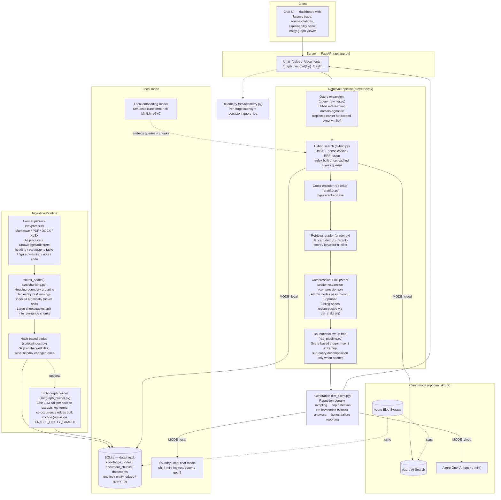

# Local RAG Assistant — Advanced Offline RAG with Foundry Local

An offline-first document Q&A assistant that answers questions grounded in
your own documents (Markdown, PDF, Word, Excel/CSV), running entirely
on-device with [Microsoft Foundry Local](https://learn.microsoft.com/azure/ai-foundry/foundry-local/).

This isn't a naive "embed and cosine-similarity" RAG demo. Documents are
parsed into a **hierarchical knowledge tree** (headings, tables, figures,
warnings — not flat text) with an **entity co-occurrence graph** layered on
top, retrieval combines **hybrid search (dense + BM25)**, **cross-encoder
re-ranking**, **retrieval grading**, **LLM-based query expansion**, and a
**bounded follow-up retrieval hop** for weak matches, and every stage
exposes its scores and latency so the mechanism is visible, not a black box.

The same codebase can also switch to a **cloud mode** (Azure AI Search +
Azure OpenAI) with a single config flag, since Foundry Local exposes an
OpenAI-compatible API. Local-to-cloud portability is a config change, not a
rewrite.

> Full roadmap and design rationale for every architectural decision:
> [`docs/ROADMAP.md`](docs/ROADMAP.md)

## Why this exists

Most AI assistants assume a stable connection to the cloud. This one
doesn't. It's built for the scenario where a user has no internet access at
all — a field engineer, an air-gapped facility, a regulated environment —
and it optionally upgrades to a cloud-backed setup only when that tradeoff
is worth it (bigger document sets, shared team access, no local hardware).

## What makes this different from a tutorial RAG project

| Naive RAG (typical tutorial) | This project |
|---|---|
| Single dense (embedding) retrieval | Hybrid retrieval: dense + BM25, fused with Reciprocal Rank Fusion, index built once and cached |
| Top-K by raw similarity score | Cross-encoder re-ranking on top-K candidates before generation |
| Always trusts retrieved chunks | Retrieval grader checks relevance before the LLM sees the context; falls back to an honest "insufficient context" reply instead of hallucinating or returning a canned answer |
| Flat text, fixed-size chunking | Documents parsed into a **hierarchical node tree** (heading/paragraph/table/figure/warning/note), chunked on heading boundaries with atomic tables/figures never split mid-content |
| Markdown only | Markdown, PDF, DOCX, XLSX/CSV via a pluggable parser interface, each producing the same node-tree structure |
| Matched chunk in isolation | Full parent-section reconstruction: a matched excerpt arrives with its surrounding section content, not just a heading label |
| One-shot retrieval, no adaptivity | Bounded follow-up hop: weak initial matches trigger one extra sub-query decomposition + retrieval round (capped, never an open-ended loop) |
| No cross-document/concept relationships | Entity co-occurrence graph extracted per section, explorable as an interactive visualization |
| No visibility into *why* an answer was produced | Explainability panel: per-chunk BM25/dense/rerank scores, section/heading provenance, click-through source citations, latency breakdown per pipeline stage |
| Re-embeds every file on every run | Hash-based incremental ingestion: unchanged files are skipped entirely, changed files are cleanly re-indexed |
| Silently degrades on small/local models | Repetition-loop detection (generation *and* entity extraction) catches degenerate output and reports failure honestly instead of returning garbage |

## Architecture



**Local mode**: everything runs on the machine, no network calls after the
one-time model download. Documents are parsed into a knowledge-node tree,
chunked on heading boundaries, embedded with a local SentenceTransformer
model, and indexed in SQLite with both dense vectors and BM25 term
statistics. Chat generation runs through Foundry Local.

**Cloud mode**: the same pipeline logic, but retrieval goes through Azure AI
Search and generation through Azure OpenAI. Useful for larger document sets,
shared/team access, or when local hardware isn't available.

### RAG query flow (`process_chat_query()`, step by step)

This is what actually runs on every chat request — no step here is
aspirational, all of it is implemented in `src/rag_pipeline.py`.

```mermaid
flowchart TB
    Q(["User query"]) --> P1

    subgraph P1["1 — Query Expansion"]
        RW["rewrite_query()\nLLM-based rephrasing (domain-agnostic)\nUp to 3 query tracks total"]
    end

    P1 --> P2["2 — Embed query\n(local SentenceTransformer or Azure OpenAI embeddings)"]

    P2 --> P3

    subgraph P3["3 — Multi-track Hybrid Retrieval"]
        direction TB
        L["For each query track:"]
        L --> BM["BM25 sparse score\n(cached index)"]
        L --> DN["Dense cosine similarity\n(vectorized matrix product)"]
        BM --> RRF["Reciprocal Rank Fusion"]
        DN --> RRF
        RRF --> DD["Dedup by chunk id across tracks"]
    end

    P3 --> P4

    subgraph P4["4 — Rerank / Grade / Compress"]
        direction TB
        RR2["Cross-encoder rerank\ntop_n = 6"]
        GR2["Grade: Jaccard dedup +\nrerank_score > 0.0 OR keyword hit_ratio ≥ 0.2\n(atomic nodes exempt from Jaccard dedup)"]
        CO2["Compress:\ntables/figures/warnings pass through unpruned\ncover-page cleanup, sentence-window pruning otherwise"]
        PE["Full parent-section reconstruction\nget_children(parent_id) → expanded_section + expanded_heading"]
        RR2 --> GR2 --> CO2 --> PE
    end

    PE --> BUD["Adaptive chunk budget\ntop_score > 1.2 → 2 · > 0.65 → 4 · else → 5"]

    BUD --> HOP{"top_score ≤ 0.65?"}
    HOP -->|yes| SUBQ["decompose_into_subqueries()\n+ one bounded follow-up retrieval round\n(max 1 extra hop, merged into context)"]
    HOP -->|no| P5
    SUBQ --> P5

    P5["5 — Context packaging\nper-chunk source/page/type/section header\n+ chunks_matrix for UI telemetry"]

    P5 --> P6

    subgraph P6["6 — Generation"]
        direction TB
        PR["Prompt: answer only from chunks,\nsynthesize across all, no chunk-by-chunk narration"]
        GN["Foundry Local chat model\nfrequency/presence penalty applied"]
        GD{"Repetition loop\ndetected?"}
        PR --> GN --> GD
    end

    GD -->|yes / generation error| FAIL["Honest failure message\nchunks still listed under Reference"]
    GD -->|no| OK["Final answer + Reference\n+ telemetry + chunks_matrix"]
    OK --> LOG["log_query_event()\npersisted to query_log for later inspection"]

    KN[("knowledge_nodes")] -.-> PE
    DC[("document_chunks")] -.-> P3
```



**What's deliberately *not* in this flow yet** (see Feature status below):
there is no open-ended agentic planning loop — the follow-up hop is capped
at exactly one extra round, triggered by a cheap score threshold rather than
an LLM-driven "is this enough?" judgment. Entity-graph traversal is not yet
part of retrieval itself — the graph is currently a separate, explorable
artifact (see the graph viewer), not consulted during chunk selection.

### Measured latency (local mode, Phi-4-mini, Apple Silicon M4)

Real numbers from the telemetry panel on a representative multi-part
question, not a synthetic benchmark. Varies with document size, model, and
hardware — shown here to demonstrate the pipeline's actual per-stage cost
profile rather than to claim a fixed number.

| Stage | Latency | Notes |
|---|---|---|
| Query expansion | ~4.0s | LLM-based rewrite, capped at `max_tokens=120` (was ~27s uncapped — see note below) |
| Vector embedding | ~83ms | Local SentenceTransformer, CPU |
| Hybrid sparse/dense retrieval | ~64ms | Cached BM25 + vectorized cosine similarity |
| Cross-encoder rerank | ~807ms | `bge-reranker-base`, top 6 candidates |
| Grade + compress | ~5ms | Jaccard dedup + parent-section reconstruction |
| Token generation | ~6.5s | Full answer synthesis, `max_tokens=1000` (intentionally uncapped — "don't truncate" instruction needs headroom) |

**Why query expansion was capped:** the rewrite/decompose LLM calls only
need to produce 2-3 short lines, but were using the full
`generation_max_tokens` budget (1000) with no output-length signal to stop
early, which measured at ~27s on local hardware for no quality benefit.
Passing an explicit `max_tokens=120` to those specific calls (see
`llm_client.generate_chat_response`'s optional `max_tokens` override)
brought this down to ~4s — a ~6.7x improvement — with no observed drop in
rewrite quality. Token generation is deliberately left uncapped at 1000
since multi-part answers genuinely need that headroom.

## Feature status

Legend: [x] implemented · [~] in progress / partial · [ ] planned (see roadmap for order)

**Ingestion**
- [x] Markdown, PDF, DOCX, XLSX/CSV parsers, all producing a shared
      hierarchical node tree (heading/paragraph/table/figure/warning/note/code)
- [x] Heading-boundary structural parsing (numbering + font/style based
      heading detection, parent/child linking)
- [x] Table extraction to Markdown tables (atomic nodes, never split)
- [x] Large table/sheet row-range splitting (avoids oversized single nodes)
- [x] Figure detection (placeholder nodes; vision captioning intentionally
      out of scope — see Roadmap)
- [x] Heading-boundary chunking (replaces fixed-size chunking for tree-aware parsers)
- [x] Incremental ingestion (SHA-256 content hash dedup: skip unchanged,
      wipe + reindex changed files)
- [x] Embedding-model consistency guard (detects a local/cloud mode switch
      with incompatible vector dimensions before it crashes retrieval)
- [x] Entity co-occurrence graph extraction (opt-in via `ENABLE_ENTITY_GRAPH`,
      one LLM call per section, capped output + repetition-loop guard)

**Retrieval pipeline**
- [x] Hybrid search (BM25 + dense, RRF fusion), index built once and cached
- [x] Cross-encoder re-ranking
- [x] Query expansion (LLM-based rewriting, domain-agnostic)
- [x] Retrieval grader (relevance threshold + Jaccard dedup)
- [x] Context compression (sentence-window pruning; atomic nodes exempt)
- [x] Full parent-section reconstruction (sibling nodes pulled via
      `get_children()`, not just a heading label)
- [x] Bounded follow-up retrieval hop (score-triggered, capped at 1 extra
      hop — not an open-ended agentic loop)
- [ ] Entity-graph-aware retrieval (the graph is currently a separate
      explorable artifact, not yet consulted during chunk selection)
- [ ] Vision-model figure captioning (out of scope for this project)

**Generation reliability**
- [x] Repetition-loop detection on generation output
- [x] Repetition-loop detection on entity extraction output
- [x] No hardcoded/canned fallback answers — failures are reported as failures
- [x] Configurable generation params (max_tokens, temperature, repetition
      penalties), with per-call override support for short structured outputs

**UI / Observability**
- [x] Chat interface with per-query advanced-mode toggle
- [x] Real per-stage latency trace (wired to actual `telemetry` dict, not placeholders)
- [x] Explainability panel with real per-chunk source/page/section/rerank score
- [x] Click-through source citation viewer (`GET /source/{filename}#page=N`)
- [x] Live knowledge-base document list (`GET /documents`)
- [x] Interactive entity graph viewer (`GET /graph`, rendered via vis-network)
- [x] Microsoft Fluent Design visual theme

**Engineering**
- [x] Local/cloud mode switch via config
- [x] Configurable Foundry Local base URL (port is not assumed stable across restarts)
- [x] Persistent structured query logging (`query_log` table via `src/telemetry.py`)
- [ ] Test suite (pytest, unit + integration)
- [ ] CI pipeline (lint + tests on push)

**Evaluation**
- [ ] Labeled eval set (20-30 Q&A pairs with ground-truth sources)
- [ ] Retrieval metrics (Precision@K, Recall@K, MRR)
- [ ] Generation faithfulness scoring (local LLM-as-judge)
- [ ] Automated benchmark report (naive vs. advanced comparison)

Full detail, rationale, and build order for every item above:
[`docs/ROADMAP.md`](docs/ROADMAP.md).

## Tech stack

| Layer | Local mode | Cloud mode |
|---|---|---|
| Server | FastAPI | FastAPI (same app) |
| Parsers | Markdown, PDF (`pdfplumber`), DOCX (`python-docx`), XLSX/CSV (`pandas`) — all tree-aware | same |
| Embeddings | `SentenceTransformer` (`all-MiniLM-L6-v2`), local, CPU | Azure OpenAI embeddings / Azure AI Search vectorizer |
| Chat generation | Foundry Local (`Phi-4-mini-instruct-generic-gpu:5`) | Azure OpenAI (`gpt-4o-mini`) |
| Sparse retrieval | `rank-bm25`, index cached in memory | Azure AI Search (built-in) |
| Re-ranking | Local cross-encoder (`bge-reranker-base`) | Azure AI Search semantic ranker (optional) |
| Entity graph | Extracted at ingest time (opt-in), visualized via `vis-network` | same (extraction runs via the configured chat model regardless of mode) |
| Storage | SQLite (`data/rag.db`) — knowledge tree + chunks + entity graph + document registry + query log | Azure Blob Storage + Azure AI Search index |
| Telemetry | Persistent `query_log` table + in-response per-stage timings | Application Insights |

> **Local chat model:** this project currently runs
> `Phi-4-mini-instruct-generic-gpu:5` (3.72 GB, MIT license) via Foundry
> Local — small enough to run comfortably on 16GB unified memory (e.g.
> Apple Silicon M-series), while being far less prone to repetition-loop
> failures than sub-1B models on multi-chunk synthesis prompts. Swap it in
> `.env` via `FOUNDRY_CHAT_MODEL` if you have the hardware for something
> larger (`foundry model list` shows what's available).
>
> **Embedding model is intentionally separate from the chat model** — it's
> always the local `all-MiniLM-L6-v2` SentenceTransformer regardless of
> which chat model you pick, since embedding and chat are different tasks
> requiring different models.
>
> **Entity graph extraction is opt-in** (`ENABLE_ENTITY_GRAPH=true`) because
> it adds one LLM call per document section during ingestion — negligible
> for a handful of small files, but noticeably slower on large documents
> (e.g. a 100+ page manual with hundreds of sections). Regular ingestion
> (nodes/chunks/embeddings) is unaffected either way.

## Project layout

```
├── api/app.py                FastAPI app: routes, serves the dashboard UI
├── src/
│   ├── config.py              Central config, reads .env, MODE switch
│   ├── db.py                  SQLite schema: knowledge_nodes, document_chunks,
│   │                          documents registry, entities/entity_edges;
│   │                          schema migration on startup
│   ├── chunking.py             chunk_nodes() (tree-aware) + chunk_document() (legacy)
│   ├── graph_builder.py        Entity extraction + co-occurrence graph building
│   ├── parsers/                Pluggable document parsers, all tree-aware
│   │   ├── base.py              KnowledgeNode model, NodeType enum, parser interface
│   │   ├── markdown_parser.py
│   │   ├── pdf_parser.py
│   │   ├── docx_parser.py
│   │   └── xlsx_parser.py
│   ├── retrieval/
│   │   ├── hybrid.py             BM25 + dense fusion (RRF), cached index
│   │   ├── reranker.py           Cross-encoder re-ranking
│   │   ├── grader.py             Retrieval relevance grading + Jaccard dedup
│   │   ├── query_rewriter.py     LLM-based query expansion + sub-query decomposition
│   │   └── compression.py        Sentence-window pruning + full parent-section reconstruction
│   ├── llm_client.py           Foundry Local + Azure OpenAI client wrappers
│   ├── rag_pipeline.py         Orchestrates expansion -> retrieval -> [follow-up hop] -> generation
│   ├── azure_search.py         Azure AI Search index + query helpers
│   ├── azure_storage.py        Blob Storage document sync
│   └── telemetry.py            Persistent structured query logging
├── scripts/
│   ├── __init__.py
│   ├── ingest.py                Parse + chunk + embed + index, with hash-based dedup
│   ├── sync_azure.py            Push docs to Blob Storage + Azure AI Search
│   └── run_eval.py              Benchmark harness (planned)
├── static/                     Dashboard UI (chat, latency trace, explainability
│                                panel, entity graph viewer) — Fluent Design theme
├── docs/
│   ├── ROADMAP.md               Full advanced-RAG roadmap and build order
│   ├── sample_docs/             Example knowledge base (multi-format)
│   └── eval_set.json            Labeled Q&A pairs for benchmarking (planned)
├── tests/                       Unit + integration tests (planned)
├── data/                        SQLite DB (gitignored)
├── .env.example                 Template for environment variables
└── requirements.txt
```

## Setup — local mode (no Azure needed)

**1. Install Foundry Local**

```bash
# Windows
winget install Microsoft.FoundryLocal

# macOS
brew install microsoft/foundrylocal/foundrylocal
```

**2. Start Foundry Local and pull the chat model**

```bash
foundry service start
foundry model run Phi-4-mini-instruct-generic-gpu:5
```

`foundry service start` prints the local port it's listening on — it is
**not guaranteed to stay the same across restarts**. Note the URL it
prints (e.g. `http://127.0.0.1:49327/`).

**3. Python environment**

```bash
python -m venv .venv
source .venv/bin/activate        # Windows: .venv\Scripts\activate
pip install -r requirements.txt
cp .env.example .env
```

Leave `MODE=local` in `.env`. Set `FOUNDRY_BASE_URL` to match the port
Foundry Local printed in step 2, and `FOUNDRY_CHAT_MODEL` to
`Phi-4-mini-instruct-generic-gpu:5` (or whatever model you pulled).

**4. Ingest the sample documents**

```bash
python scripts/ingest.py
```

Parses every supported file in `docs/sample_docs/` into a knowledge-node
tree (headings, paragraphs, tables, figures), chunks it on heading
boundaries, generates embeddings and BM25 statistics, and indexes
everything in `data/rag.db`. Re-running this is safe and fast — unchanged
files are skipped via content hash comparison.

To also build the entity graph during ingestion (adds one LLM call per
section — slower on large documents):

```bash
ENABLE_ENTITY_GRAPH=true python scripts/ingest.py
```

**5. Run the app**

```bash
uvicorn api.app:app --reload
```

Open `http://127.0.0.1:8000`. Turn off Wi-Fi and it still works.

## Setup — cloud mode (optional, Azure)

Requires an Azure subscription.

**1. Provision resources** — Azure AI Search (Free tier), a Storage Account,
an Azure OpenAI resource with a `gpt-4o-mini` deployment, and Application
Insights. See `scripts/sync_azure.py` header comment for exact SKUs.

**2. Fill in `.env`**

```
MODE=cloud
AZURE_SEARCH_ENDPOINT=...
AZURE_SEARCH_KEY=...
AZURE_SEARCH_INDEX=rag-index
AZURE_STORAGE_CONNECTION_STRING=...
AZURE_OPENAI_ENDPOINT=...
AZURE_OPENAI_KEY=...
AZURE_OPENAI_DEPLOYMENT=gpt-4o-mini
APPLICATIONINSIGHTS_CONNECTION_STRING=...
```

**3. Sync documents and switch mode**

```bash
python scripts/sync_azure.py
uvicorn api.app:app --reload
```

The dashboard UI and API surface are identical — only `MODE` changes.

## Evaluation

Planned, not yet implemented (see Feature status above and
[`docs/ROADMAP.md`](docs/ROADMAP.md)):

```bash
python scripts/run_eval.py
```

Will run a labeled eval set (`docs/eval_set.json`) against both naive and
advanced retrieval configurations, and write a comparison report
(Precision@K, Recall@K, MRR, faithfulness) to `docs/eval_report.md`.

## Cost & safety notes (cloud mode)

- Azure AI Search Free tier and Application Insights' free ingestion quota
  cover this project's needs at $0.
- Azure OpenAI is billed per token — set a **budget alert** in the Azure
  portal before testing.
- Never commit `.env`. `.env.example` is the only file that should be
  tracked.
- If deploying a public demo, put a request-rate limit in front of the
  `/chat` endpoint so a public repo doesn't turn into an open tap on your
  credit.

## Testing

Not yet implemented — tracked in Feature status / roadmap.

```bash
pytest tests/
```

## Roadmap

See [`docs/ROADMAP.md`](docs/ROADMAP.md) for the full advanced-RAG build
plan, prioritized day-by-day, with the reasoning behind each architectural
choice.

## Changelog

**feat: full parent-section expansion, entity graph, bounded multi-hop, latency fixes**

- `compression.py`: parent-context expansion now reconstructs the full
  sibling section via `get_children()` instead of only looking up the
  parent's heading text.
- `api.py` + `static/index.html`: added a click-through source citation
  viewer (`GET /source/{filename}#page=N`) linking each retrieved chunk
  back to its original document page.
- `query_rewriter.py`: replaced the hardcoded synonym dictionary with
  LLM-based query rewriting, domain-agnostic; added
  `decompose_into_subqueries()` for the new follow-up hop.
- `rag_pipeline.py`: added a bounded (max 1 extra) follow-up retrieval
  hop, triggered by a cheap rerank-score threshold rather than an LLM
  "is this enough?" call.
- `db.py`: added `entities`/`entity_edges` tables, schema migration for
  pre-existing databases, and an embedding-model consistency guard to
  catch a local/cloud mode switch before it crashes retrieval.
- `graph_builder.py` (new): per-section entity extraction and
  co-occurrence graph building, opt-in via `ENABLE_ENTITY_GRAPH`, with a
  repetition-loop guard and regex-tolerant JSON parsing after an initial
  version produced zero entities across an entire large document due to
  a prompt-echo repetition loop.
- `telemetry.py`: implemented persistent structured query logging
  (previously an empty placeholder).
- `query_rewriter.py` / `llm_client.py`: capped `max_tokens` on short
  structured LLM calls (query rewriting, sub-query decomposition, entity
  extraction) — query expansion latency dropped from ~27s to ~4s with no
  observed quality loss.
- `static/index.html`: Microsoft Fluent Design visual theme (Segoe UI,
  Microsoft blue palette, acrylic surfaces) and an interactive entity
  graph viewer (`vis-network`).
- `xlsx_parser.py`: large sheets are now split into multiple row-range
  table nodes instead of one oversized node per sheet.

**docs(readme): rewrite architecture to match current node-tree RAG implementation**

Replaced the aspirational architecture diagram (agentic sub-query router,
loop/scratchpad retrieval) with one matching the actual
`process_chat_query()` flow. Added a step-by-step RAG query flow diagram.
Corrected the feature status table: parent-child expansion marked partial
(parent-only lookup, no child reconstruction), agentic multi-hop downgraded
to planned (query expansion is deterministic synonym substitution, not
LLM-based). Updated tech stack and setup docs for
`Phi-4-mini-instruct-generic-gpu:5` and the configurable Foundry Local base
URL. Marked incremental ingestion as implemented.

## License

MIT — see `LICENSE`.