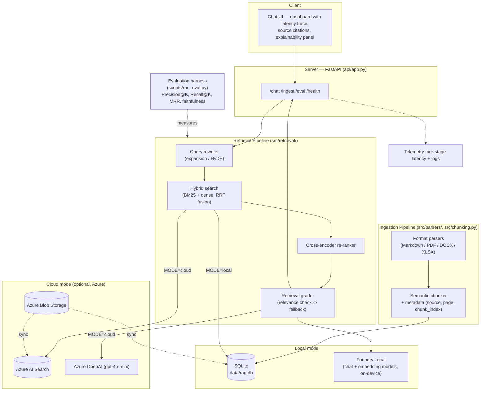

# Local RAG Assistant — Advanced Offline RAG with Foundry Local

An offline-first document Q&A assistant that answers questions grounded in
your own documents (Markdown, PDF, Word, Excel/CSV), running entirely
on-device with [Microsoft Foundry Local](https://learn.microsoft.com/azure/ai-foundry/foundry-local/).

This isn't a naive "embed and cosine-similarity" RAG demo. The retrieval
pipeline combines **hybrid search (dense + BM25)**, **cross-encoder
re-ranking**, **retrieval grading**, and **query rewriting** — the same
techniques used in production-grade RAG systems — and every stage exposes
its scores and latency so the mechanism is visible, not a black box.

The same codebase can also switch to a **cloud mode** (Azure AI Search +
Azure OpenAI) with a single config flag, since Foundry Local exposes an
OpenAI-compatible API. Local-to-cloud portability is a config change, not a
rewrite.

> Full roadmap and design rationale for every architectural decision:
> [`docs/ROADMAP.md`](docs/ROADMAP.md)

## Why this exists

Most AI assistants assume a stable connection to the cloud. This one
doesn't. It's built for the scenario where a user has no internet access at
all — a field engineer, an air-gapped facility, a regulated environment —
and it optionally upgrades to a cloud-backed setup only when that tradeoff
is worth it (bigger document sets, shared team access, no local hardware).

## What makes this different from a tutorial RAG project

| Naive RAG (typical tutorial) | This project |
|---|---|
| Single dense (embedding) retrieval | Hybrid retrieval: dense + BM25, fused with Reciprocal Rank Fusion |
| Top-K by raw similarity score | Cross-encoder re-ranking on top-K candidates before generation |
| Always trusts retrieved chunks | Retrieval grader checks relevance before the LLM sees the context; falls back to "I don't know" instead of hallucinating |
| Fixed-size chunking | Semantic chunking on topic-shift boundaries |
| Markdown only | Markdown, PDF, DOCX, XLSX/CSV via a pluggable parser interface |
| No visibility into *why* an answer was produced | Explainability panel: per-chunk BM25/dense/rerank scores, latency breakdown per pipeline stage, source citations you can click into |
| No quantified quality claim | A benchmark harness with a labeled eval set reports Precision@K / Recall@K / MRR and faithfulness scores, comparing naive vs. advanced retrieval numerically |

## Architecture



**Local mode**: everything runs on the machine, no network calls after the
one-time model download. Documents (of any supported format) are parsed,
semantically chunked, embedded with Foundry Local's embedding model, and
indexed in SQLite with both dense vectors and BM25 term statistics.

**Cloud mode**: the same pipeline logic, but retrieval goes through Azure AI
Search and generation through Azure OpenAI. Useful for larger document sets,
shared/team access, or when local hardware isn't available.

## Feature status

Legend: [x] implemented · [~] in progress · [ ] planned (see roadmap for order)

**Retrieval pipeline**
- [x] Hybrid search (BM25 + dense, RRF fusion)
- [x] Cross-encoder re-ranking
- [x] Query rewriting / multi-query retrieval
- [x] Retrieval grader (Self-RAG style relevance check)
- [x] Context compression (sentence-window retrieval)

**Ingestion**
- [x] Markdown parsing + chunking
- [x] Semantic chunking (topic-boundary based, replacing fixed-size)
- [x] PDF parser (`pdfplumber`)
- [x] DOCX parser (`python-docx`)
- [x] XLSX/CSV parser (`pandas`)
- [ ] Incremental ingestion (hash-based dedup)

**UI / Observability**
- [x] Basic chat interface
- [x] Per-stage latency trace (embedding / retrieval / rerank / generation)
- [ ] Explainability panel (per-chunk score breakdown)
- [ ] Source citation viewer
- [ ] Naive-vs-Advanced comparison toggle

**Engineering**
- [x] Local/cloud mode switch via config
- [ ] Test suite (pytest, unit + integration)
- [ ] Structured logging with request tracing
- [ ] CI pipeline (lint + tests on push)

**Evaluation**
- [ ] Labeled eval set (20-30 Q&A pairs with ground-truth sources)
- [ ] Retrieval metrics (Precision@K, Recall@K, MRR)
- [ ] Generation faithfulness scoring (local LLM-as-judge)
- [ ] Automated benchmark report (naive vs. advanced comparison)

Full detail, rationale, and day-by-day build order for every item above:
[`docs/ROADMAP.md`](docs/ROADMAP.md).

## Tech stack

| Layer | Local mode | Cloud mode |
|---|---|---|
| Server | FastAPI | FastAPI (same app) |
| Parsers | Markdown, PDF (`pdfplumber`), DOCX (`python-docx`), XLSX/CSV (`pandas`) | same |
| Embeddings | Foundry Local (`qwen3-embedding-0.6b`) | Azure OpenAI embeddings / Azure AI Search vectorizer |
| Sparse retrieval | `rank-bm25` | Azure AI Search (built-in) |
| Re-ranking | Local cross-encoder (`bge-reranker-base` or ONNX equivalent) | Azure AI Search semantic ranker (optional) |
| Generation | Foundry Local chat model | Azure OpenAI (`gpt-4o-mini`) |
| Storage | SQLite (`data/rag.db`) — vectors + BM25 stats + metadata | Azure Blob Storage + Azure AI Search index |
| Telemetry | Local structured logs | Application Insights |

> **Model note:** chat and embedding must use *different* models — a
> general chat model is not an embedding model. This repo's `config.env`
> currently needs a fix here (embedding should point to
> `qwen3-embedding-0.6b`, not the chat model) — tracked as the first item
> before hybrid search work begins, since every retrieval experiment after
> that depends on embeddings being correct.

## Project layout

```
├── api/app.py                FastAPI app: routes, serves the dashboard UI
├── src/
│   ├── config.py              Central config, reads .env, MODE switch
│   ├── db.py                  SQLite schema (vectors, BM25 stats, metadata)
│   ├── chunking.py             Semantic chunker
│   ├── parsers/                Pluggable document parsers
│   │   ├── base.py              Parser interface (protocol)
│   │   ├── markdown_parser.py
│   │   ├── pdf_parser.py
│   │   ├── docx_parser.py
│   │   └── xlsx_parser.py
│   ├── retrieval/
│   │   ├── hybrid.py             BM25 + dense fusion (RRF)
│   │   ├── reranker.py           Cross-encoder re-ranking
│   │   ├── grader.py             Retrieval relevance grading
│   │   └── query_rewrite.py      Query expansion / HyDE
│   ├── llm_client.py           Foundry Local + Azure OpenAI client wrappers
│   ├── rag_pipeline.py         Orchestrates parsing -> retrieval -> generation
│   ├── azure_search.py         Azure AI Search index + query helpers
│   ├── azure_storage.py        Blob Storage document sync
│   └── telemetry.py            Latency tracing + structured logging
├── scripts/
│   ├── ingest.py                Parse + chunk + embed + index documents
│   ├── sync_azure.py            Push docs to Blob Storage + Azure AI Search
│   └── run_eval.py              Benchmark harness (Faz 5)
├── static/                     Dashboard UI (chat, latency trace, explainability panel)
├── docs/
│   ├── ROADMAP.md               Full advanced-RAG roadmap and build order
│   ├── sample_docs/             Example knowledge base (multi-format)
│   └── eval_set.json            Labeled Q&A pairs for benchmarking
├── tests/                       Unit + integration tests
├── data/                        SQLite DB (gitignored)
├── config.example.env           Template for environment variables
└── requirements.txt
```

## Setup — local mode (no Azure needed)

**1. Install Foundry Local**

```bash
# Windows
winget install Microsoft.FoundryLocal

# macOS
brew install microsoft/foundrylocal/foundrylocal
```

**2. Python environment**

```bash
python -m venv .venv
source .venv/bin/activate        # Windows: .venv\Scripts\activate
pip install -r requirements.txt
cp config.example.env .env
```

Leave `MODE=local` in `.env` — no Azure credentials required for this mode.

**3. Ingest the sample documents**

```bash
python scripts/ingest.py
```

Parses every supported file in `docs/sample_docs/` (Markdown, PDF, DOCX,
XLSX), semantically chunks it, generates embeddings and BM25 statistics via
Foundry Local, and indexes everything in `data/rag.db`. Prints an ingestion
report: file count, chunk count, token counts per file.

**4. Run the app**

```bash
uvicorn api.app:app --reload
```

Open `http://127.0.0.1:8000`. Turn off Wi-Fi and it still works.

## Setup — cloud mode (optional, Azure)

Requires an Azure subscription (e.g. the Azure for Students $100 credit).

**1. Provision resources** — Azure AI Search (Free tier), a Storage Account,
an Azure OpenAI resource with a `gpt-4o-mini` deployment, and Application
Insights. See `scripts/sync_azure.py` header comment for exact SKUs.

**2. Fill in `.env`**

```
MODE=cloud
AZURE_SEARCH_ENDPOINT=...
AZURE_SEARCH_KEY=...
AZURE_SEARCH_INDEX=rag-index
AZURE_STORAGE_CONNECTION_STRING=...
AZURE_OPENAI_ENDPOINT=...
AZURE_OPENAI_KEY=...
AZURE_OPENAI_DEPLOYMENT=gpt-4o-mini
APPLICATIONINSIGHTS_CONNECTION_STRING=...
```

**3. Sync documents and switch mode**

```bash
python scripts/sync_azure.py
uvicorn api.app:app --reload
```

The dashboard UI and API surface are identical — only `MODE` changes.

## Evaluation

```bash
python scripts/run_eval.py
```

Runs the labeled eval set (`docs/eval_set.json`) against both naive and
advanced retrieval configurations, and writes a comparison report
(Precision@K, Recall@K, MRR, faithfulness) to `docs/eval_report.md`.

## Cost & safety notes (cloud mode)

- Azure AI Search Free tier and Application Insights' free ingestion quota
  cover this project's needs at $0.
- Azure OpenAI is billed per token — set a **budget alert** in the Azure
  portal before testing.
- Never commit `.env`. `config.env` is the only file that should be
  tracked.
- If deploying a public demo, put a request-rate limit in front of the
  `/chat` endpoint so a public repo doesn't turn into an open tap on your
  credit.

## Testing

```bash
pytest tests/
```

## Roadmap

See [`docs/ROADMAP.md`](docs/ROADMAP.md) for the full advanced-RAG build
plan, prioritized day-by-day, with the reasoning behind each architectural
choice.

## License

MIT — see `LICENSE`.